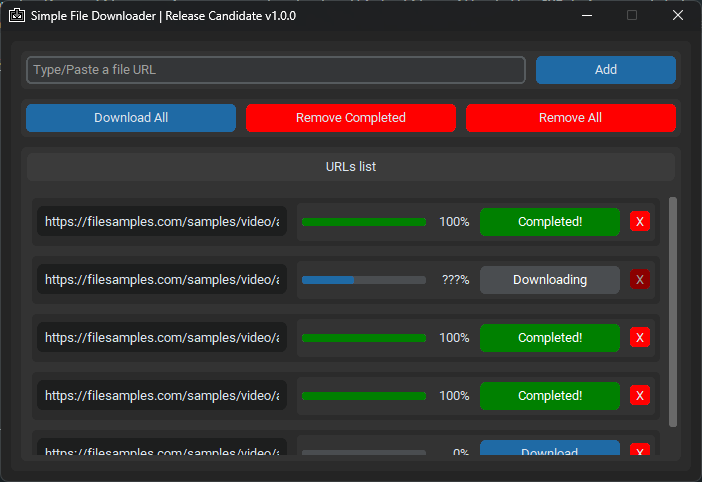

# Simple File Downloader
A Simple File Downloader made with Python and customtkinter, where you can download multiple files.

I made it as challenge for myself on how to make a program that download multiple files without having the GUI to be frozen.

## Features
- Add/Remove download tasks
- Start (all) download tasks
- Cancel download tasks
- The GUI doesn't freeze when downloading a file, meaning you can download multiple files without the GUI being completely frozen
- It saves the files on the Download folder of the user on a subfolder of the same name of the program

Program Icon made by Me  
Example files by [picsum.photos](https://picsum.photos/) and [filesamples.com](https://filesamples.com/)
